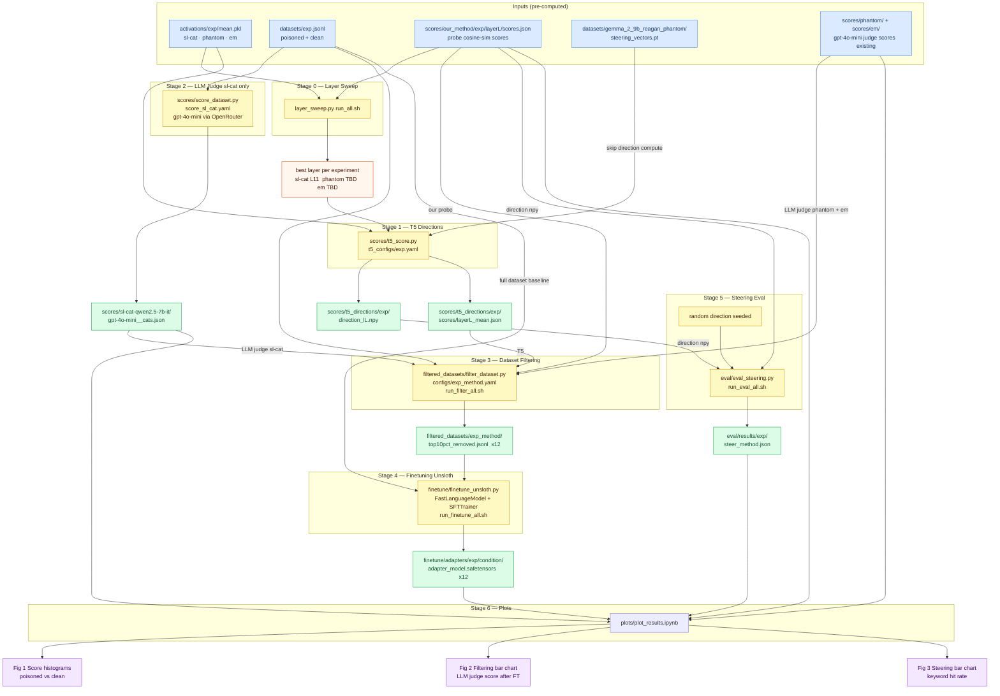

# Evaluation Pipeline



## Experiments

| Exp | Poisoned dataset | Model | Our probe ✓ | LLM judge ✓ | T5 `.pt` |
|---|---|---|---|---|---|
| **sl-cat** | `sl-cat-qwen2.5-7b-it.jsonl` | Qwen 7B | ✓ | run Stage 2 | computed |
| **phantom** | `phantom-reagan.jsonl` | Gemma 9B | ✓ | ✓ existing | pre-built `.pt` |
| **em** | `em-medical-combined5050-seed42.jsonl` | Qwen 7B | ✓ | ✓ existing | computed |

## Filtering conditions (per experiment)

| Condition | Score source | Output dir |
|---|---|---|
| Our probe | `scores/our_method/{exp}/layer{L}/…json` | `filtered_datasets/{exp}_our_probe/` |
| T5 | `scores/t5_directions/{exp}/scores/layer{L}_mean.json` | `filtered_datasets/{exp}_t5/` |
| LLM judge | `scores/{exp}/gpt-4o-mini__*.json` | `filtered_datasets/{exp}_llm_judge/` |

## Run order

```
Stage 0  layer_sweep/run_all.sh          # determines best_layer per exp
Stage 1  python scores/t5_score.py t5_configs/sl-cat.yaml   # (and phantom, em)
Stage 2  python scores/score_dataset.py scores/score_sl_cat.yaml
Stage 3  filtered_datasets/run_filter_all.sh
Stage 4  finetune/run_finetune_all.sh
Stage 5  eval/run_eval_all.sh
Stage 6  jupyter nbconvert --execute plots/plot_results.ipynb
```
